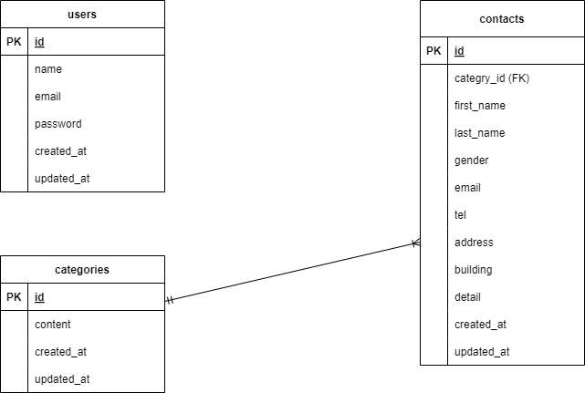

## アプリケーション名
確認テスト：お問い合わせフォーム

---

## ER図


---

## プロジェクト概要
このアプリケーションは、ユーザーからのお問い合わせを受け付けるためのフォームです。  
データはデータベースに保存され、管理者が確認できる仕様になっています。

---

### 主な機能
- ユーザーのお問い合わせをフォームで受け付け
- 入力内容のバリデーション
- データベースへの保存
- 送信後の確認メッセージ表示

---

## 必要な環境
- **PHP**: バージョン 7.3 以上
- **Laravel**: バージョン 8.75
- **Composer**: バージョン 2.0 以上
- **MySQL**: バージョン 8.0 以上
- **Docker**: バージョン 27.2.0 以上
- **Docker Compose**: バージョン 2.0 以上

---

## URL
- アプリケーション: `http://localhost` （Nginx経由）
- phpMyAdmin: `http://localhost:8080`

---

## デフォルトのデータベース設定
`docker-compose.yml` で設定されているデータベースの初期情報は以下の通りです。  
デフォルトのパスワードをそのまま本番環境で使用しないでください。

- データベース名: `laravel_db`
- ユーザー名: `laravel_user`
- パスワード: `laravel_pass`
- MySQLのルートパスワード: `root`

---

## セットアップ方法
1.リポジトリをクローンする
   リポジトリを GitHub からローカルにコピーします。
   以下のどちらかを選んでコマンドを実行してください。

   - **HTTPSを使用する場合**:
     ```bash
     git clone https://github.com/shimodum/ability-test.git
     ```

   - **SSHを使用する場合**:
     ```bash
     git clone git@github.com:shimodum/ability-test.git
     ```
   **クローン後、プロジェクトディレクトリに移動します**:
     ```bash
     cd contact-form
   
2.Docker コンテナを起動する  
　　Docker Compose を使用して必要なサービスを立ち上げます。  
   初回起動や Dockerfile に変更があった場合には、以下のコマンドを実行してコンテナをビルドし直します。

　　docker-compose up -d --build
   
3.依存関係をインストールする  
 　 PHP コンテナ内で Composer を使ってライブラリをインストールします。

    docker-compose exec php composer install
 
4.環境変数を設定する  
　 環境設定ファイル .env.example を .env にコピーし、アプリケーションの秘密鍵を生成します。

   cp .env.example .env
　 php artisan key:generate

5.データベースをマイグレートする  
   アプリケーションで使用するデータベースのテーブルを作成します。
   
   docker-compose exec php php artisan migrate
   
6.データをシーディングする  
　 必要な初期データをデータベースに投入します。

　　docker-compose exec php php artisan db:seed
   

   
   
   
   
   
   